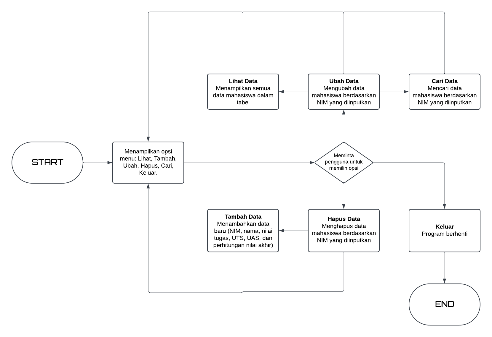
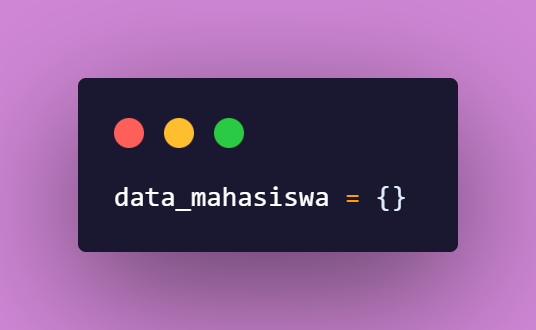
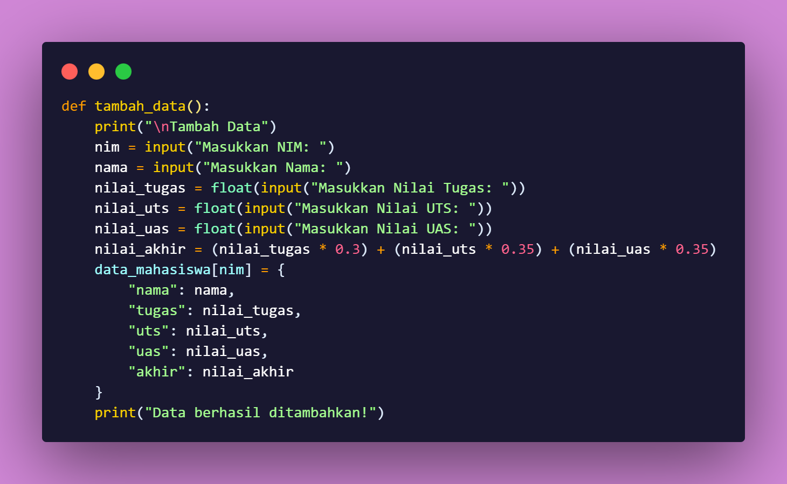
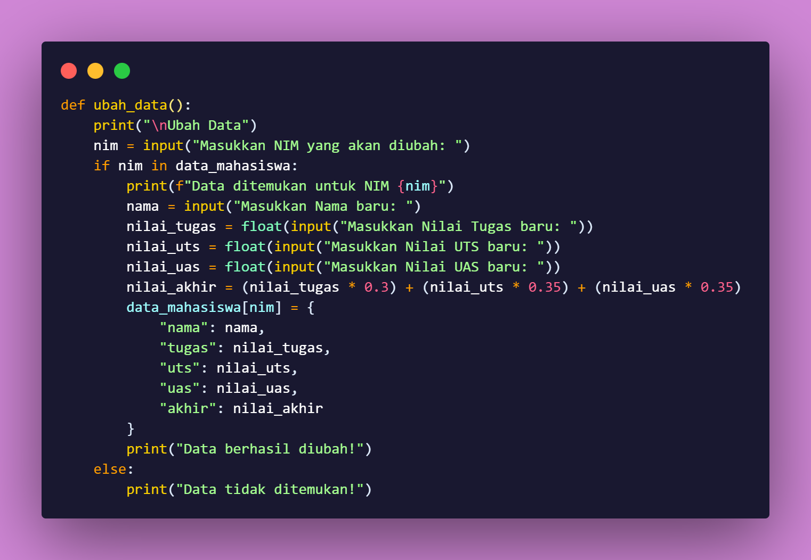
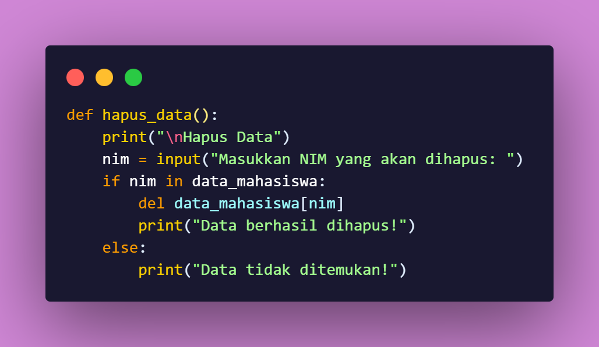
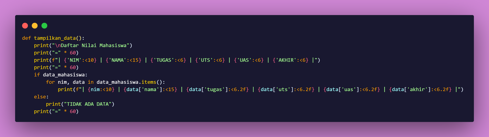
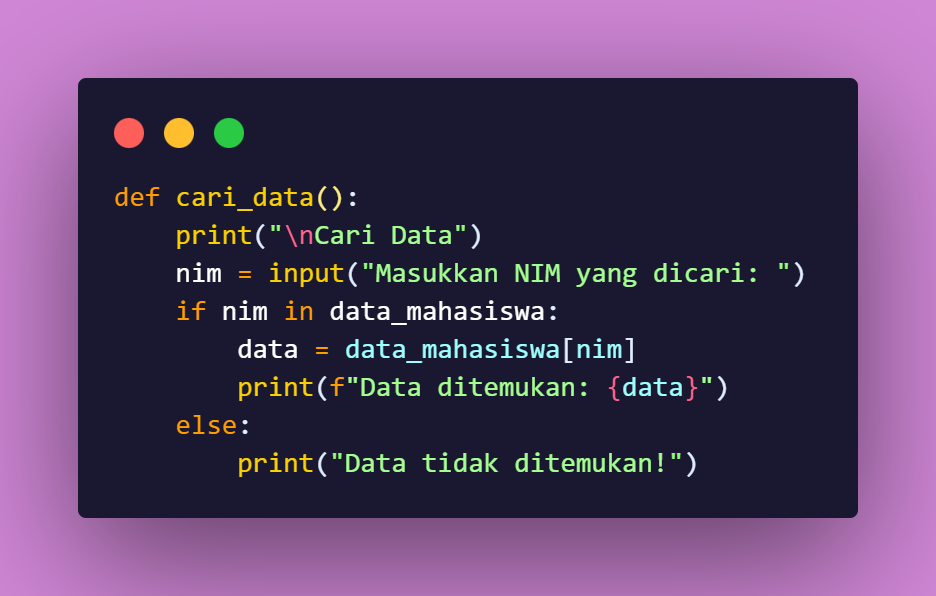
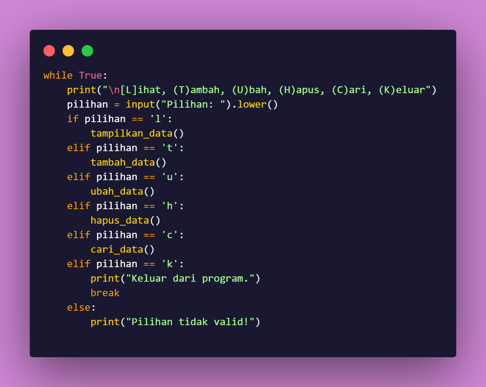
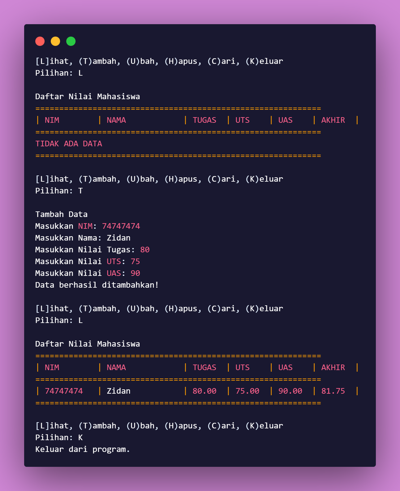

# Praktikum5
## Flowchart

Kali ini kita akan membuat kode program berdasarkan flowchart tersebut

## Penjelasan

Langkah pertama adalah membuat sebuah dictionary kosong supaya nanti bisa di tambahkan dengan data

Berikutnya adalah membuat fitur yang akan dipakai sebagai pengolah data, yang pertama yaitu fitur menambahkan data. Jika user memilih huruf "T" maka User akan disuruh untuk menginputkan NIM, Nama, Nilai Tugas, Nilai UTS, dan Nilai UAS

Selanjutnya yaitu fitur mengubah data. Jika user memilih huruf "U" maka nanti user akan diminta untuk Memasukkan NIM dari data mahasiswa yang akan diubah

Lalu Berikutnya, yaitu fitur hapus data. Jika user memilih huruf "H" maka nanti user akan diminta untuk Memasukkan NIM dari data mahasiswa yang akan dihapus

Lalu adalah Tampilkan data. Jika user memilih huruf "L" maka nanti semua data yang telah di tambahkan akan di tampilkan

Dan fitur selanjutnya yaitu mencari data. Jika user memilih huruf "C" maka nanti user akan diminta memasukkan NIM mahasiswa untuk mencari data tersebut

Lalu yang terakhir adalah program yang meminta user untuk memilih fitur yang tersedia seperti "[L]ihat, [T]ambah, [U]bah, [H]apus, [C]ari, [K]eluar"

## Output

Lalu nanti hasil akhirnya akan menjadi seperti ini

# Terima Kasih